# Introduction & Background from Assignment 1
We are analyzing bulk RNA sequencing data from the GEO database, accession number: GSE213001, which looks at the lung tissue of people affected and unaffected by idiopathic pulmonary fibrosis (IPF). This data is associated with an article by Jaffar et al. published in 2022 [@jaffar_matrix_2022] which investigates a biomarker of IPF disease development. 

Out of the total 15,065 genes, 8,192 genes passed the p < 0.05 threshold (also threshold used in the Jaffar et al. article) and 7,182 passed FDR correction (at most 5% of significant genes are expected to be false positives) after differential expression analysis. 

# Thresholded over-representation analysis
Thresholded over-representation analysis is used to determine whether pathways or gene sets are enriched in a given (thresholded) list of differentially expressed genes. 

## g:Profiler
I chose to use g:Profiler as I am the most familiar with it and because it has flexibility regarding the annotation data used. g:Profiler performs a gene-set enrichment analysis using a hypergeometric test (Fisher’s exact test) to find whether a given gene list is statistically over-represented in known biological pathways/gene sets.

The version of g:Profiler used was e113_eg59_p19_6be52918 (web version) [@kolberg_gprofilerinteroperable_2023]. The annotation data used was from Gene Ontology (GO) [@the_gene_ontology_consortium_gene_2026] & [@ashburner_gene_2000], Reactome [@milacic_reactome_2024], and WikiPathways [@agrawal_wikipathways_2024]. No electronic GO annotations were included as they are more likely to be inaccurate. For ambiguous genes, the EnsemblID with more GO annotations was kept. 

The 7,182 genes passing FDR correction were made into three text files for downstream analyses: one with all genes passing FDR correction, one with only up-regulated genes and one with only down-regulated genes. 

```{r, message=FALSE}
library(tidyverse)
# Code used to extract differentially expressed genes from Assignment 1
#write_csv(results, "a1_results.csv")
results <- read_csv("a1_results.csv")

# Filter for FDR < 0.05 (all genes)
sig_genes <- results %>%
  filter(adj.P.Val < 0.05) %>%
  pull(`HGNC symbol`)

# Make a file with the gene names
write.table(sig_genes, file = "A2_data/significant_genes.txt", row.names = FALSE, col.names = FALSE, quote = FALSE)

# Only up-regulated genes: 
up_reg_genes <- results %>%
  filter(adj.P.Val < 0.05 & logFC > 0) %>%
  pull(`HGNC symbol`)

write.table(up_reg_genes, file = "A2_data/up_reg_genes.txt", row.names = FALSE, col.names = FALSE, quote = FALSE)

# Only down-regulated genes: 
down_reg_genes <- results %>%
  filter(adj.P.Val < 0.05 & logFC < 0) %>%
  pull(`HGNC symbol`)

write.table(down_reg_genes, file = "A2_data/down_reg_genes.txt", row.names = FALSE, col.names = FALSE, quote = FALSE)

```

### All genes: 
After the initial query, the default gene set (term) size between 7 to 10,000 gives us 551 results from Gene Ontology, 57 results from Reactome, and 19 results from WikiPathways (Fig. 1). After restricting gene set size to 3-250 (based on the Bader Lab's workflow ([g:Profiler tutorial](https://baderlab.github.io/CBW_Pathways_2024/gprofiler-lab.html#gprofiler-lab)), since very large gene sets are too broad causing overlaps are less informative, and small gene sets are likely not well characterized), GO had 267 hits, Reactome had 47 hits and WikiPathways having 19 hits. An overview of these results can be seen below (Fig. 1 and 2).

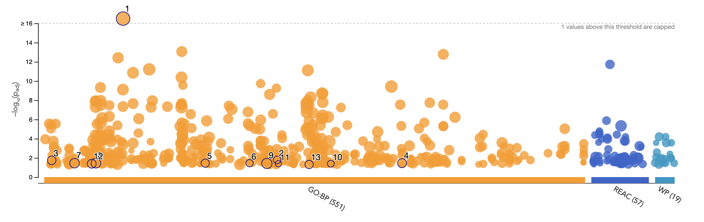
**Figure 1.** Overview of g:Profiler hits using annotation data from Gene Ontology biological processes (orange), Reactome (dark blue) and WikiPathways (light blue) terms for combined top differentially expressed genes. Numbers in parentheses on x-axis represent the number of gene sets that passed the 0.05 threshold.

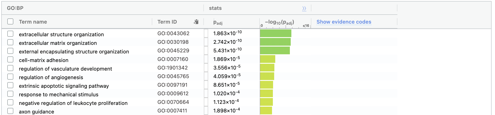
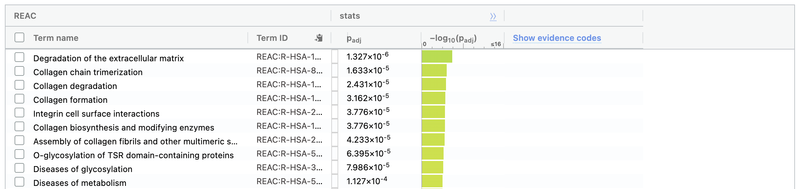
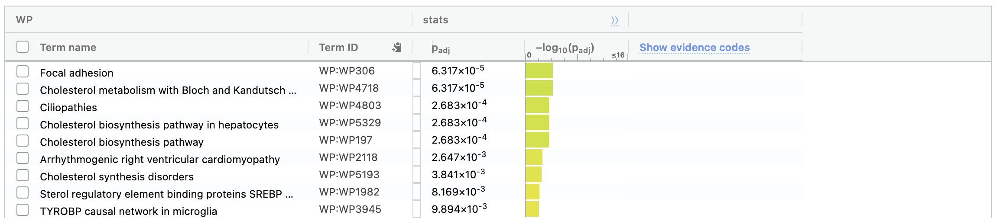
**Figure 2.** Preview of top Gene Ontology, Reactome and WikiPathways terms across all differentially expressed genes. Gene set size is limited between 3 and 250. 

### Up-regulated genes

Looking at the same overview, but for only up-regulated genes (notes: term size was defaulted to 4-10,000 instead of 7-10,000), there are more Reactome and Wikipathways hits than the combined list. After thresholding gene set size to between 3 and 250, there were 308 GO hits, 63 Reactome hits and 27 WikiPathways hits. These values are all higher than with the combined list, which makes sense as having up-regulated and down-regulated genes involved in pathways weakens the overall enrichment signal. 

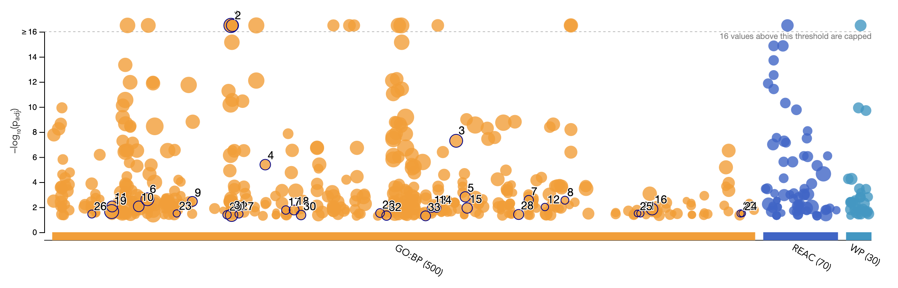
**Figure 3.** Overview of g:Profiler hits using annotation data from Gene Ontology biological processes (orange), Reactome (dark blue) and WikiPathways (light blue) terms for only up-regulated genes in diseased (IPF) tissues. Numbers in parentheses on x-axis represent the number of gene sets that passed the 0.05 threshold.

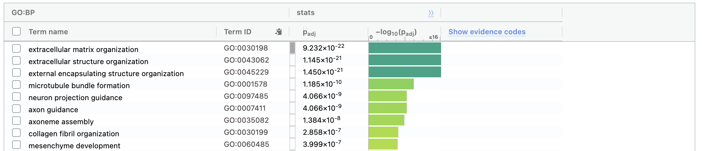
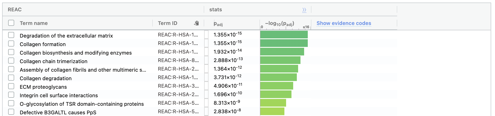
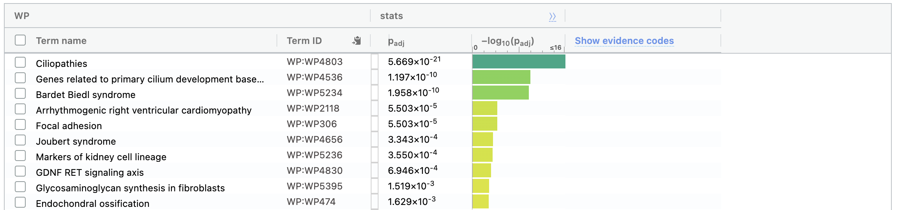
**Figure 4.** Preview of top Gene Ontology, Reactome and WikiPathways terms for up-regulated genes. Gene set size is limited between 3 and 250.

### Down-regulated genes
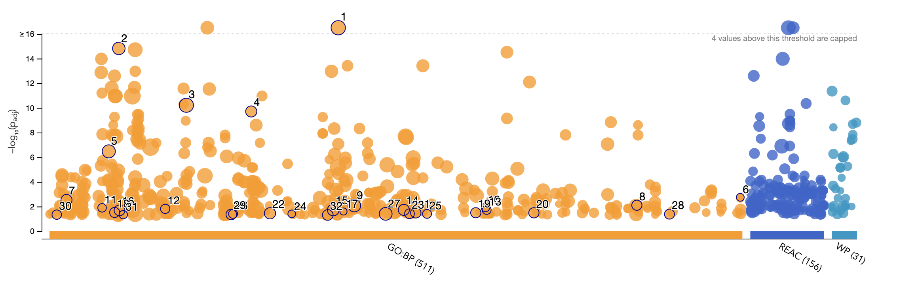
**Figure 5.** Overview of g:Profiler hits using annotation data from Gene Ontology biological processes (orange), Reactome (dark blue) and WikiPathways (light blue) terms for only down-regulated genes in diseased (IPF) tissues. Numbers in parentheses on x-axis represent the number of gene sets that passed the 0.05 threshold.

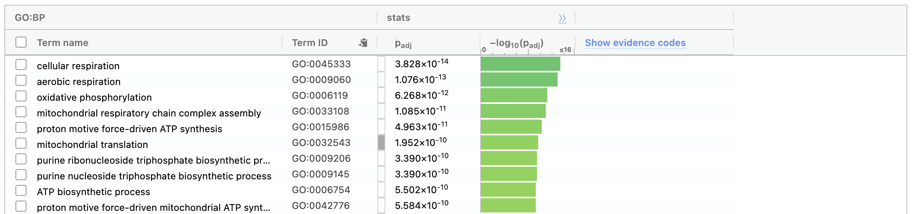
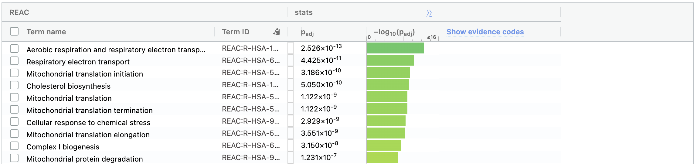
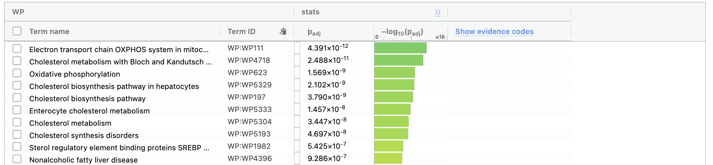
**Figure 6.** Preview of top Gene Ontology, Reactome and WikiPathways terms for down-regulated genes. Gene set size is limited between 3 and 250.

Comparing the output from these three gene lists (up-regulated genes, down-regulated genes and both combined), we can see that Gene Ontology: Biological Process has the most gene sets passing the threshold when up and down-regulated genes are combined. On the other hand, Reactome and WikiPathways have the most passing gene sets when processed separately. This can be explained by the fact that GO terms tend to be more broad, and having more genes will result in more GO terms that overlap with our list. Reactome and WikiPathways, however look at more specific pathways, which are sensitive to contradicting (up-regulation and down-regulation) signals. When these signals are separate, the pathways appear more enriched as they no longer cancel each other out. 

## Interpretation
Amongst up-regulated genes, the top GO terms are related to the extra cellular matrix (i.e. extracellular structure and matrix organization, external encapsulating-structure organization, cell-matrix adhesion), whereas amongst down-regulated genes the top GO terms are related to cellular respiration (i.e. cellular/aerobic respiration, oxidative phosphorylation). The top Reactome hits follow a similar trend. When considering all genes, more of the top hits come from the up-regulated list than the down-regulated list (top terms are related to extra cellular structure). This makes sense as dysfunction of the extracellular matrix is a defining feature of IPF; the extracellular matrix becomes stiff and fibrotic, distorting the alveoli and preventing gas exchange [@thannickal_matrix_2014]. 

The top hit for WikiPathways in up-regulated genes was cliopathies; disorders affecting the cilia. A study by Lee et al. [@lee_increased_2018] found that there were increased primary cilia in lung tissue affected by IPF, which supports this result. When maximum gene set size is increased from 250 to 500, the top GO terms for up-regulated gene sets are cilium organization and cilium assembly, which respectively become ranked 6th and 5th overall with the combined gene list. The original paper by Jaffar et al. emphasized that matrix metalloproteinase-7 expression is elevated in end-stage IPF, and this is one of the genes featured on our up-regulated gene list. In combination with the increased presence of cilia, this again suggests that up-regulated genes have the greater contribution to IPF development. 

Interestingly, regulation of vasculature development and regulation of angiogenesis are both in the top 10 GO terms for the combined list of genes (under the initial 3-250 gene set size limit; vasculature-related terms are ranked 15+ when increasing the maximum to 500), but are not featured in the terms of the up and down-regulated genes separately. Studies have previously shown that IPF-affected tissues can display both increased and decreased vascularization [@barratt_vascular_2014], however, it was noted that this may just be a consequence of the disease rather than one of its mechanisms. The fact that genes involved in vascularization are not seen when analyzing up and down-regulated genes separately could suggest they play a more passive role rather than being essential contributors to disease development. 

# Non-thresholded over-representation analysis
A non-thresholded over-representation analysis does not use an arbitrary cutoff like p<0.05, and instead uses a ranked list of all genes. 

## GSEA 
Our method of choice was gene set enrichment analysis (GSEA; [@subramanian_gene_2005]), one of the most popular gene set analysis methods that employs a modified Kolmogorov-Smirnov statistic. The app version of GSEA (GSEA_4.4.0) was used, as I find it more straightforward. 

First, a rank file must be created using the following equation to determine a score for each gene: (-log10(pvalue) * sign(logFC). Note that sign(logFC) represents whether fold change is positive (gene is more highly expressed in diseased tissue) or negative (gene is more highly expressed in normal tissue). 

```{r}
# Calculate score for all genes and make into a list sorted by decreasing score
ranked_list <- -log10(results$P.Value) * sign(results$logFC)
names(ranked_list) <- results$`HGNC symbol`
ranked_list <- sort(ranked_list, decreasing = TRUE)

# Make into a data frame to add gene name column 
ranked_df <- data.frame(gene = names(ranked_list), score = ranked_list)     

# Make into a .rnk file (tab separated)
write.table(ranked_df, file = "A2_data/ranked_list.rnk", sep = "\t", row.names = FALSE, col.names = FALSE, quote = FALSE)
```

Next, the Gene Matrix Transposed (GMT) file can be downloaded from the [Bader Lab website](https://download.baderlab.org/EM_Genesets/current_release/Human/symbol/) [@reimand_pathway_2019]. The GMT file used was Human_GOBP_AllPathways_noPFOCR_no_GO_iea_March_02_2026_symbol.gmt (human pathways, no Pathway Figure OCR, no GO terms as gene sets, no electronically inferred annotations). This file notably contains gene sets from Gene Ontology [@the_gene_ontology_consortium_gene_2026], Reactome [@milacic_reactome_2024], WikiPathways [@agrawal_wikipathways_2024], and MSigDB [@liberzon_molecular_2015], to be tested for enrichment in our ranked list. 

```{r, message=FALSE}
# Retrieve GMT file from Bader Lab website
if(!require("RCurl", quietly = TRUE)) {
  install.packages("RCurl")
}
library(RCurl)
gmt_url = "https://download.baderlab.org/EM_Genesets/current_release/Human/symbol/"
# List files from the link 
filenames = getURL(gmt_url)
tc = textConnection(filenames)
contents = readLines(tc)
close(tc)
# get the gmt that has all the pathways and does not include terms inferred
# from electronic annotations(IEA) start with gmt file that has pathways only
rx = gregexpr("(?<=<a href=\")(.*.GOBP_AllPathways_noPFOCR_no_GO_iea.*.)(.gmt)(?=\">)",
                contents, perl = TRUE)
gmt_file = unlist(regmatches(contents, rx))
dest_gmt_file <- file.path("./A2_data", gmt_file)
download.file(paste(gmt_url, gmt_file, sep = ""), destfile = dest_gmt_file)

# This file contained duplicate pathway names; needed to remove duplicates: 
# Read in file, extract pathway names, and make lowercase 
gmt_lines <- readLines(dest_gmt_file) 
pathway_names <- tolower(sapply(strsplit(gmt_lines, "\t"), `[`, 1))
gmt_dedup <- gmt_lines[!duplicated(pathway_names)]

# Only keep one occurance of each pathway
dedup_gmt_filepath <- "./A2_data/Human_GOBP_AllPathways_noPFOCR_no_GO_iea_March_02_2026_symbol_dedup.gmt"

# Make a new file
writeLines(gmt_dedup, dedup_gmt_filepath)
```
The default minimum and maximum gene set size of 15 and 500 were used. Note that GSEA minimum/maximum applies to genes in the gene set that are also in the ranked list we provide (g:Profiler, on the web interface, only looks at total genes in the gene set, not overlap). 2,000 permutations were performed (number of gene set randomizations used to calculate false discovery rate), as suggested by the Pathways and Network Analysis of -Omics Data 2024 Workshop [@voisin_module_nodate]. 

## Results and Interpretation
### Diseased tissues
In diseased tissues, 2967 out of 6431 gene sets (after applying size threshold) are up-regulated. 567 gene sets pass the (raw) pvalue < 0.05 threshold, and 330 pass the pvalue < 0.01 threshold. Figure 7 shows the top ten enriched gene sets in IPF tissues. All ten of the top gene sets are related to the extracellular matrix. The top gene set, epithelial-mesenchymal transition, is a process that is a key contributor to fibrosis; it causes an accumulation of fibrous tissue and excessive development of the extracellular matrix [@li_epithelial-mesenchymal_2016]. Collagen is key structural protein that helps form the extracellular matrix, and it also appears several times on this list. In IPF, collagen accumulation contribute to IPF [@thannickal_matrix_2014]. These results align with the results from the thresholded ORA, and actually appear more relevant at first glance (i.e. all top ten are clearly liked).

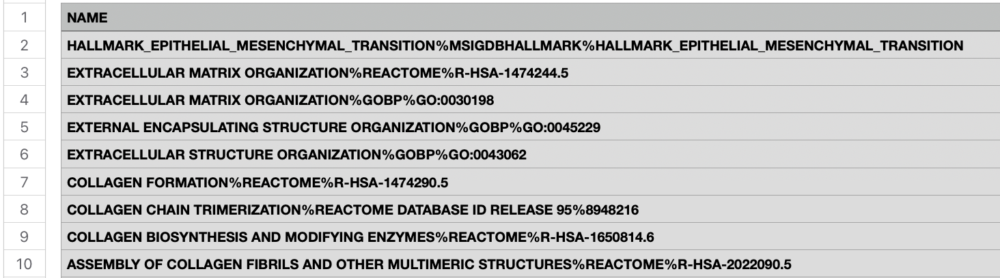
**Figure 7.** Top 10 most enriched genes in diseased (IPF) tissues.

### Healthy tissues 
In healthy tissues, 3464 out of 6431 gene sets (after limiting gene set size) are upregulated. 884 are enriched with a raw pvalue < 0.05, and 524 are enriched when raw pvalue < 0.01. Figure 7 shows the top ten enriched gene sets in healthy tissues. The top gene set is a superpathway of cholesterol biosynthesis, which is very different from the g:Profiler results which were dominated by cellular respiration and mitochondrial metabolism-linked gene sets. This is likely due to the fundamental difference in how g:Profiler and GSEA determine what gene sets are most enriched. g:Profiler uses differentially expressed genes based on a pre-determined threshold (here, pvalue < 0.05), which may exclude some genes that are up/down regulated to a lesser extent. GSEA uses the ranked list which contains all genes, not just those that are individually significantly differentially expressed, and therefore it can detect enrichment as a result of more several, subtle changes in expression. Genes that are down-regulated in diseased tissues may have been impacted more by this difference in methodology as genes that were already lowly expressed may be missed entirely by g:Profiler as they do not pass the cutoff. For this reason, it is difficult to directly compare our thresholded and non-thresholded results .

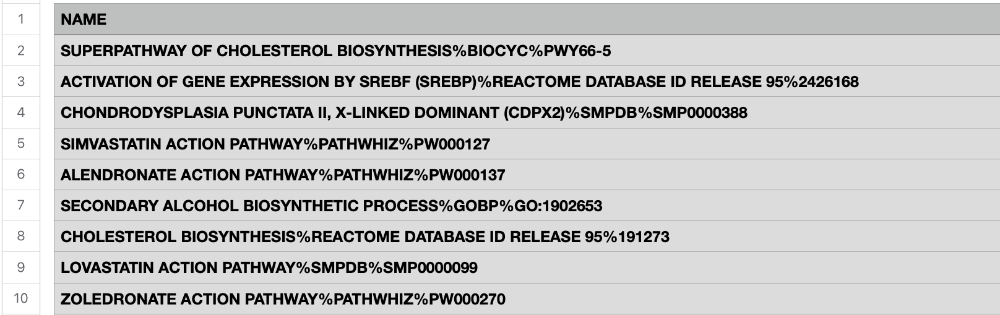
**Figure 8.** Top 10 most enriched genes in healthy tissues.

## Visualization in Cytoscape
Finally, an enrichment map was made to visualize the non-thresholded gene set enrichment analysis results. This was done using EnrichmentMap [@merico_enrichment_2010] and AutoAnnotate [@kucera_autoannotate_2016] in Cytoscape [@shannon_cytoscape_2003]. 

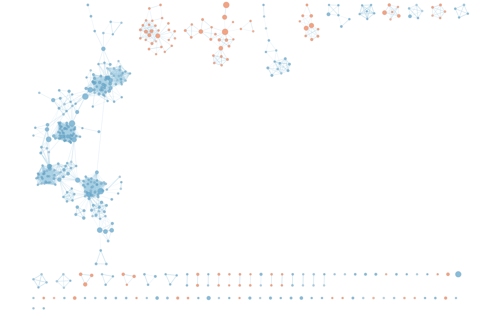
**Figure 9.** Initial enrichment map of GSEA results, generated in Cytoscape. Gene sets up-regulated in diseased tissues are in red and those that are down-regulated are in blue. FDR q-value set to 0.05. 

A node cutoff of 0 (q-value; most stringent) and an edge cutoff of 0.4 was used to decrease noise in the enrichment map, while maintaining the (presumed) main clusters. Then, AutoAnnotate was used to create defined clusters, also checking the box to minimize cluster overlap. After visual assessment of the output, clusters containing less than 5 nodes were removed. This resulted in 5 clusters and two independent nodes ("Ciliopathies" and "Hallmark Epithelial Mesenchymal Transition") remaining. These two nodes are statistically significant, but were not grouped into clusters by AutoAnnotate (not connected to other nodes even with the most lenient edge cutoff). I chose to keep them due to their relevance to IPF (see [Interpretation](#interpretation) and [Diseased tissues](#diseased-tissues)). Finally, red nodes, representing up-regulated gene sets in diseased tissues and blue nodes, representing down-regulated gene sets in diseased tissues, were grouped together for ease of interpretation. 

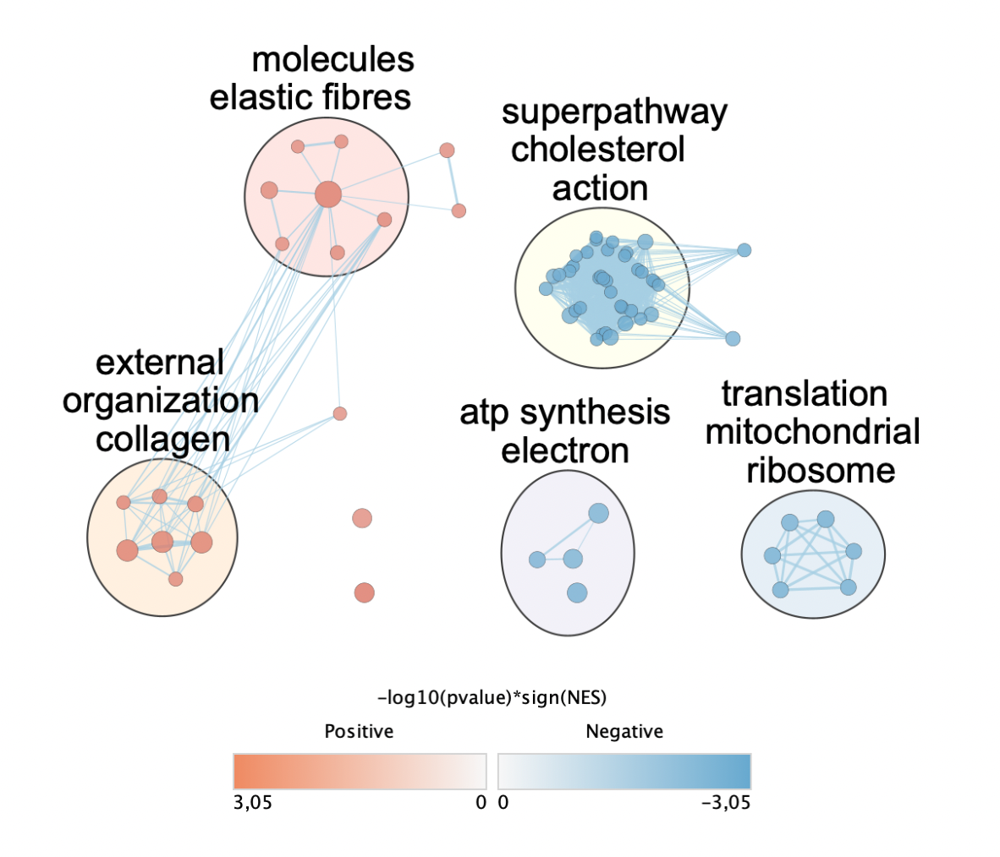
**Figure 10.** Final enrichment map of GSEA results comparing diseased IPF tissues to normal tissues. Gene sets up-regulated in diseased tissues are in red and those that are down-regulated are in blue. Node cutoff = 0 (most stringent q-value) and edge cutoff = 0.4. The two lone red nodes represent ciliopathies (upper) and hallmark epithelial mesenchymal transition (lower). 

As with in previous analyses, the link between up-regulated gene sets and IPF is most evident. Elastic fibres are a key component of the extracellular matrix, and IPF is caused by its dysregulation and overgrowth [@thannickal_matrix_2014]. Collagen is another essential component of the extracellular matrix, and its over expression can limit the resolution of fibrosis [@thannickal_matrix_2014]. As previously mentioned, ciliopathies and epithelial mesenchymal transition (the two independent nodes in figure 10) also have clear ties to IPF; see [Interpretation](#interpretation) and [Diseased tissues](#diseased-tissues). 

# Conclusion
We conducted both a thresholded over representation analysis using g:Profiler, and a non-thresholded analysis with GSEA on RNAseq data from idiopathic pulmonary fibrosis affected and unaffected tissues. Both methods provide lists of up and down-regulated genes, however these lists have differences due to the different processes used to determine what gene sets are over expressed. Through visualizing the data, we were able to identify some of the main pathways involved in this disease. 

# References